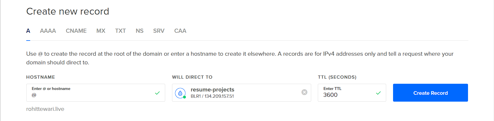

# Deploying MERN Stack App on DigitalOcean

In this tutorial, we'll deploy a MERN Stack application on a DigitalOcean server in the cloud with SSL/HTTPS encryption and a custom domain.

Furthermore, Nginx will be used as a reverse proxy and Let's Encrypt and Certbot will be used to configure SSL/HTTPS encryption for your application.

When the Node.js application is running on the server, we'll use PM2 to keep the application running forever without any downtime.

### Let's get started!


<!-- TABLE OF CONTENTS -->

### Table of Contents
<ol>
  <li>
  <a href="#step-1---create--configure-a-new-digitalocean-server">Create & Configure A New DigitalOcean Server</a>

  <ul>
    <li><a href="#create-new-droplet-on-digitalocean">Create New Droplet On DigitalOcean</a></li>
  </ul>

  <ul>
    <li><a href="#setting-up-ssh-in-digitalocean-droplet">Setting up SSH in DigitalOcean Droplet</a></li>
  </ul>

  <ul>
    <li><a href="#access-the-server-using-root">Access The Server Using Root</a></li>
  </ul>

  <ul>
    <li><a href="#create-a-new-user">Create A New User</a></li>
  </ul>

  <ul>
    <li><a href="#give-your-new-user-root-privileges">Give Your New User Root Privileges</a></li>
  </ul>

  <ul>
    <li><a href="#add-ssh-keys-for-new-account">Add SSH keys for new account</a></li>
  </ul>

  <ul>
    <li><a href="#disable-password-authentication">Disable Password Authentication</a></li>
  </ul>

  <ul>
    <li><a href="#test-log-in-using-ssh-key">Test Log In Using SSH Key</a></li>
  </ul>

  <ul>
    <li><a href="#basic-firewall-set-up">Basic Firewall Set Up</a></li>
  </ul>
  </li>

  <li>
    <a href="#step-2---configure-your-domain-name">Configure Your Domain Name</a>

  <ul>
    <li><a href="#configure-dns">Configure DNS</a></li>
  </ul>

  <ul>
    <li><a href="#configure-your-domain-registrar-to-direct-the-domain-to-digitalocean">Configure Your Domain Registrar To Direct The Domain To DigitalOcean</a></li>
  </ul>
  </li>

  <li>
  <a href="#step-3---install--configure-nginx">Install & Configure Nginx</a>

  <ul>
    <li><a href="#install-nginx">Install Nginx</a></li>
  </ul>

  <ul>
    <li><a href="#adjust-the-firewall">Adjust The Firewall</a></li>
  </ul>

  <ul>
    <li><a href="#test-your-web-server">Test Your Web Server</a></li>
  </ul>
  </li>

  <li>
  <a href="#step-4---configure-the-nodejs-application">Configure The Node.js Application</a>

  <ul>
    <li><a href="#install-nodejs">Install Node.js</a></li>
  </ul>

  <ul>
    <li><a href="#create-a-nodejs-application">Create a Node.js application</a></li>
  </ul>
  </li>

  <li>
  <a href="#step-5---install--configure-pm2">Install & Configure PM2</a>

  <ul>
    <li><a href="#install-pm2">Install PM2</a></li>
  </ul>

  <ul>
    <li><a href="#start-application">Start Application</a></li>
  </ul>
  </li>

  <li>
  <a href="#step-6---setup-nginx-as-a-reverse-proxy">Setup Nginx As A Reverse Proxy</a>
  </li>

  <li>
  <a href="#step-7---configure-sslhttps-using-lets-encrypt--certbot">Configure SSL/HTTPS Using Let's Encrypt & Certbot</a>

  <ul>
    <li><a href="#install-certbot">Install Certbot</a></li>
  </ul>

  <ul>
    <li><a href="#allow-https-access-in-your-firewall">Allow HTTPS Access In Your Firewall</a></li>
  </ul>

  <ul>
    <li><a href="#get-the-ssl-certificate-from-certbot">Get The SSL Certificate From Certbot</a></li>
  </ul>

  <ul>
    <li><a href="#verify-certbot-auto-renew">Verify Certbot Auto-Renew</a></li>
  </ul>
  </li>
</ol>

## Step 1 - Create & Configure A New DigitalOcean Server

Before we can do anything, we need to create and configure a VPS (Virtual Private Server) in the cloud to host our application.

### Create New Droplet On DigitalOcean

After logging in or successfully signing up for a new account, open the Create drop-down menu and click the Droplets link.

In the first section, select the Ubuntu operating system for your server.


Then, choose the $6 per month standard plan, which will give your application plenty of computing power to start with. You can easily upgrade in the future if needed.


Next, they allow you to choose the datacenter region for your server. This is the physical location for your server and, therefore, you should choose the one closest to the people visiting your website.


In the Authentication section, make sure the SSH keys option is selected for more security and passwordless login to your server.


<p align="right">(<a href="#deploying-mern-stack-app-on-digitalocean">back to top</a>)</p>

### Setting up SSH in DigitalOcean Droplet

Click on the `New SSH Key` button and a pop up will open to add a public SSH key.


You need to generate an SSH key on your local machine to login to your server remotely. Open your terminal and type:

```bash
$ ssh-keygen
```

By default, it will create your public and private key files in the .ssh directory on your local machine and name them **id_rsa** and **id_rsa.pub**. You can change this if you want, just make sure when it asks, you put the entire path to the key as well as the filename. I am using **digital_ocean_key**.

Once you do that, you need to copy the public key. You can use the `cat` command and then copy the key

```bash
$ cat ~/.ssh/digital_ocean_key.pub
```

Copy the key. It will look something like this:

```bash
ssh-rsa AAAAB3NzaC1yc2EAAAADAQABAAABgQDEwMkP0KHX19q2dM/9pB9dpB2B/FwdeP4egXCgdEOraJuqGvaylKgbu7XDFinP6ByqJQg/w8vRV0CsFXrnr+Lh51fKv8ZPvV/yRIMjxKzNn/0+asatkjrkOwT3f3ipbzfS0bsqfWTHivZ7UNMrOHaaSezxvJpPGbW3aoTCFSA/sUUUSiWZ65v7I/tFkXE0XH+kSDFbLUDDNS1EzofWZFRcdSFbC3zrGsQHN3jcit6ba7bACQYixxFCgVB0mZO9SOgFHC64PEnZh5hJ8h8AqIjf5hDF9qFdz2jFEe/4aQmKQAD3xAPKTXDLLngV/2yFF0iWpnJ9MZ/mJoLVzhY2pfkKgnt/SUe/Hn1+jhX4wrz7wTDV4xAe35pmnajFjDppJApty+JOzKf3ifr4lNeZ5A99t9Pu0294BhYxm7/mKXiWPsevX9oSZxSJmQUtqWWz/KBVoVjlTRgAgLYbKCNBzmw7+qdRxoxxscQCQrCpJMlat56vxK8cjqiESvduUu78HHE= rtewa@DESKTOP-HQRNFTC
```

Now paste that into the textarea and name it (eg. digital_ocean_key)


Also, you can choose a hostname for your server. This will give your server a name to remember it by.


When you're done selecting options, hit the Create Droplet button to kick off the creation of your new server.


Your server is now up and running!


In the next step, we'll complete the initial configuration process for the server. This will include logging into the server, setting up SSH access to the server, and creating a basic firewall.

<p align="right">(<a href="#deploying-mern-stack-app-on-digitalocean">back to top</a>)</p>

### Access The Server Using Root

The first step is to gain access to the server using your root login.

To log into your server, open a terminal on your local machine and use the following command to SSH in as the root user (replace `SERVER_IP_ADDRESS` with your server's public IP address and `PRIVATE_KEY` with the private key file name):

```bash
ssh -i ~/.ssh/PRIVATE_KEY_FILE_NAME root@SERVER_IP_ADDRESS
```

Accept the warning about host authenticity, if it appears.

The `root` user in a Linux environment has very broad privileges and, for that reason, you are discouraged from using it on a regular basis.

Therefore, in the next step, we are going to create an alternative account with limited scope that will be used for daily work.

<p align="right">(<a href="#deploying-mern-stack-app-on-digitalocean">back to top</a>)</p>

### Create A New User

Right now you are logged in as `root` and it is a good idea to create a new account.

You can check your current user with the command:

```console
root@hostname:~# whoami
```

It will say `root` right now.

Let's add a new user. I am going to call my user `rohit`

```console
root@hostname:~# adduser rohit
```

Just hit enter through all the questions. You will be asked for a use password as well. You can just hit `ENTER` repeatedly to skip the rest of the questions.


<p align="right">(<a href="#deploying-mern-stack-app-on-digitalocean">back to top</a>)</p>

### Give Your New User Root Privileges

You now have a new user account with regular account privileges. But you might occasionally need to do administrative tasks that require `root` privileges.

To do this, we need to add your new user to the `sudo` group on the machine.

As `root`, run the following command to add your user to the `sudo` group (substitute `rohit` with your username):

```console
root@hostname:~# usermod -aG sudo rohit
```

Now your user can run commands with `root` privileges!

<p align="right">(<a href="#deploying-mern-stack-app-on-digitalocean">back to top</a>)</p>

### Add SSH keys for new account

Assuming you generated an SSH key pair. Use the following command at the terminal of your local machine to print your public key (`digital_ocean_key.pub`):

```bash
$ cat ~/.ssh/digital_ocean_key.pub
```

Copy the key. It will look something like this:

```bash
ssh-rsa AAAAB3NzaC1yc2EAAAADAQABAAABgQDEwMkP0KHX19q2dM/9pB9dpB2B/FwdeP4egXCgdEOraJuqGvaylKgbu7XDFinP6ByqJQg/w8vRV0CsFXrnr+Lh51fKv8ZPvV/yRIMjxKzNn/0+asatkjrkOwT3f3ipbzfS0bsqfWTHivZ7UNMrOHaaSezxvJpPGbW3aoTCFSA/sUUUSiWZ65v7I/tFkXE0XH+kSDFbLUDDNS1EzofWZFRcdSFbC3zrGsQHN3jcit6ba7bACQYixxFCgVB0mZO9SOgFHC64PEnZh5hJ8h8AqIjf5hDF9qFdz2jFEe/4aQmKQAD3xAPKTXDLLngV/2yFF0iWpnJ9MZ/mJoLVzhY2pfkKgnt/SUe/Hn1+jhX4wrz7wTDV4xAe35pmnajFjDppJApty+JOzKf3ifr4lNeZ5A99t9Pu0294BhYxm7/mKXiWPsevX9oSZxSJmQUtqWWz/KBVoVjlTRgAgLYbKCNBzmw7+qdRxoxxscQCQrCpJMlat56vxK8cjqiESvduUu78HHE= rtewa@DESKTOP-HQRNFTC
```

Select the public key, and copy it to your clipboard.

To enable the use of the SSH key to authenticate as the new remote user, you must add the public key to a special file called `authorized_keys` in the user's home directory.

**On your DigitalOcean server** and as the `root` user, enter the following command to temporarily switch to the new user (substitute `rohit` with your username):

```console
root@hostname:~# su - rohit
```

Now you will be in your new user's home directory.

Create a new directory called `.ssh` and restrict its permissions with the following commands:

```console
rohit@hostname:~$ mkdir ~/.ssh && chmod 700 ~/.ssh
```

Now create a new file in `.ssh` called `authorized_keys` with a text editor. We'll use `nano` to edit the file:

```console
rohit@hostname:~$ nano ~/.ssh/authorized_keys
```

Now insert your public key (which should be in your clipboard) by pasting it into the editor.

Hit `CTRL-X` to exit the file, then `Y` to save the changes that you made, then `ENTER` to confirm the file name.

Now restrict the permissions of the `authorized_keys` file with this command:

```console
rohit@hostname:~$ chmod 600 ~/.ssh/authorized_keys
```

Type this command once to return to the `root` user:

```console
rohit@hostname:~$ exit
```

Now your public key is installed, and you can use SSH keys to log in as your user.

<p align="right">(<a href="#deploying-mern-stack-app-on-digitalocean">back to top</a>)</p>

### Disable Password Authentication

This is an extra security step. We can disable passwords so that only your local machine with the correct SSH keys can login.

As the `root` user or new `sudo` user on your **DigitalOcean server**, open the SSH daemon configuration file using the following command:

```console
rohit@hostname:~$ sudo nano /etc/ssh/sshd_config
```

Find the line that says `PasswordAuthentication` and change its value to `no`. It should look like this after the change was made:

```bash
PasswordAuthentication no
```

Save and close the file using the method: `CTRL-X`, then `Y`, then `ENTER`.

To reload the SSH daemon and put the changes live, execute the following command:

```console
rohit@hostname:~$ sudo systemctl reload sshd
```

Password authentication is now disabled. Now your server can only be accessed with SSH key authentication.

<p align="right">(<a href="#deploying-mern-stack-app-on-digitalocean">back to top</a>)</p>

### Test Log In Using SSH Key

Let's test logging in using the SSH key.

On your **local machine**, SSH into your server using the new account that we created. Use the following command to do so (substitute your username and IP address):

```bash
$ ssh USERNAME@SERVER_IP_ADDRESS
```

If you have too many keys on your local Machine, then you can try specifying which key you want to use:

```bash
$ ssh -i ~/.ssh/PRIVATE_KEY_FILE_NAME USERNAME@SERVER_IP_ADDRESS
```

Once authentication is provided to the server, you will be logged in as your new user.

<p align="right">(<a href="#deploying-mern-stack-app-on-digitalocean">back to top</a>)</p>

### Basic Firewall Set Up

Another security improvement we can make to the server is to add a basic firewall so that people can not directly access any port except ports for ssh, http and https

On your **DigitalOcean server**, you can see which applications UFW currently allows by typing:

```console
rohit@hostname:~$ sudo ufw app list
```

This should output the following:

```bash
Available applications
  OpenSSH
```

We need to make sure the firewall allows SSH connections so that we can log back in next time. To allow these types of connections, type the following command:

```console
rohit@hostname:~$ sudo ufw allow OpenSSH
```

And then enable the firewall:

```console
rohit@hostname:~$ sudo ufw enable
```

Press `y` and then `ENTER` to proceed. You can see that SSH connections are still allowed by typing:


```console
rohit@hostname:~$ sudo ufw status
```

That was the last step in the initial setup for the server.

<p align="right">(<a href="#deploying-mern-stack-app-on-digitalocean">back to top</a>)</p>

## Step 2 - Configure Your Domain Name

In this section, we'll configure a domain name that you want to use for your Node.js application.

To set up a domain, you'll need to do two things:

1. Purchase a domain name from a domain name registrar.

2. Setup DNS (Domain Name System) records for your domain by using a DNS hosting service.

DigitalOcean is not a domain name registrar, which means you can't purchase a domain name from them. But, they do provide a DNS hosting service that makes it easy to configure a domain name with their servers.

### Configure DNS

Using DigitalOcean, let's configure DNS for your domain.

Back on the DigitalOcean website, open the Create drop-down menu and click the Domains/DNS link.

In the Add a Domain section, enter your domain (this is usually the base only: `example.com` and not `www.example.com`) and click the Add Domain button.


After you click the **Add Domain** button, you will be taken to the **Create new record** page.

You now need to add NS records for the domain on DigitalOcean servers. You'll only be adding `A` records, which maps an `IPv4 address` to a domain name. This will determine where to direct any requests for your domain name.

Therefore, we need to create two `A` records for your website.

For the first one, enter `@` in the `HOSTNAME` field and select the server you want to point the domain name to:



For the second one, enter `www` in the `HOSTNAME` field and select the same server:


Make sure the `A` records are pointed to the correct server droplet.

Awesome, we can move on to the next step.

<p align="right">(<a href="#deploying-mern-stack-app-on-digitalocean">back to top</a>)</p>

### Configure Your Domain Registrar To Direct The Domain To DigitalOcean

To use the DigitalOcean DNS, you'll need to update the nameservers used by your domain registrar to point at DigitalOcean's nameservers instead.

As an example, we'll walk you through the steps for doing this for `Name.com`. But, these steps can be easily replicated for whatever other service you used (GoDaddy, HostGator, etc.).

First, sign in to your `Name.com` account and click `My Domains` link on the top navigation bar. You will be presented with a dashboard listing all of your domains.

Click the `Quick Links` dropdown then `Manage Domain` button of the domain you'd like to update.


In the `Nameservers` section of the resulting screen, click `Manage Nameservers` then enter the following nameservers:

* `ns1.digitalocean.com`
* `ns2.digitalocean.com`
* `ns3.digitalocean.com`


It may take some time for the name server changes to propagate after you've saved them.

During this time, the domain registrar communicates the changes you've made with your ISP (Internet Service Provider). In turn, your ISP caches the new nameservers to ensure quick site connections. This process usually takes about 30 minutes but could take up to a few hours depending on your registrar and your ISP's communication methods.

You should now have a domain pointing at your newly created DigitalOcean server.

<p align="right">(<a href="#deploying-mern-stack-app-on-digitalocean">back to top</a>)</p>

## Step 3 - Install & Configure Nginx

Now we need to install NGINX to serve our app on port 80, which is the http port

### Install Nginx

Nginx is available in Ubuntu's default repositories, so installation is pretty straightforward.

On your **DigitalOcean server**, run the following commands to update your local `apt package` index so we have access to the most recent package lists:

```console
rohit@hostname:~$ sudo apt-get update && sudo apt-get install nginx
```

The `apt-get` command will install Nginx along with any other required dependencies.

When those commands finish, Nginx will be available for you to use on the server.

<p align="right">(<a href="#deploying-mern-stack-app-on-digitalocean">back to top</a>)</p>

### Adjust The Firewall

Before we can test Nginx, we need to reconfigure our firewall software to allow access to the service. Nginx registers itself as a service with `ufw`, our firewall, upon installation. This makes it rather easy to allow Nginx access.

```console
rohit@hostname:~$ sudo ufw app list
```

You should get a listing of the application profiles:

```bash
Available applications:
  Nginx Full
  Nginx HTTP
  Nginx HTTPS
  OpenSSH
```

There are three profiles available for Nginx:

* **Nginx Full**: Opens both port `80` (normal, unencrypted web traffic) and port `443` (`TLS/SSL` encrypted traffic)
* **Nginx Http**: Opens only port `80` (normal, unencrypted web traffic)
* **Nginx Https**: Opens only port `443` (`TLS/SSL` encrypted traffic)

It is recommended that you enable the most restrictive profile that will still allow the traffic you've configured. Since we haven't configured SSL for our server yet, in this guide, we will only need to allow traffic on port `80`.

When we configure SSL/HTTPS encryption later on, we'll change these settings.

You can enable this by typing:

```console
rohit@hostname:~$ sudo ufw allow 'Nginx HTTP'
```

You can verify the change with this command:

```console
rohit@hostname:~$ sudo ufw status
```

You should see Nginx HTTP listed in the output.

<p align="right">(<a href="#deploying-mern-stack-app-on-digitalocean">back to top</a>)</p>

### Test Your Web Server

The Nginx web server should already be up and running.

You can check with the systemd init system to make sure the service is running by typing:

```console
rohit@hostname:~$ systemctl status nginx
```

This should output the following:


You can access the default Nginx landing page to confirm that it is running properly. You can access this through your server's domain name or IP address.

When you have your server's IP address or domain, enter it into your browser's address bar:

```bash
http://SERVER_DOMAIN_OR_IP
```

You should see the default Nginx landing page, which should look something like this:


You now have a web server running!

<p align="right">(<a href="#deploying-mern-stack-app-on-digitalocean">back to top</a>)</p>


## Step 4 - Configure The Node.js Application

You should now have a server running with Nginx.

Now you are ready to install Node.js and configure your application.

### Install Node.js

We will install the latest LTS release of Node.js, using the [NodeSource](https://github.com/nodesource/distributions "NodeSource") package archives.

First, you need to install the NodeSource PPA to get access to its contents. We'll use `curl` to retrieve the installation script for the Latest LTS Version of Node.js archives.

First, make sure you have navigated to your home directory:

```console
rohit@hostname:~$ cd ~
```

Then, you can retrieve the installation script:

```console
rohit@hostname:~$ curl -sL https://deb.nodesource.com/setup_lts.x -o nodesource_setup.sh
```

And run the script using `sudo`:

```console
rohit@hostname:~$ sudo bash nodesource_setup.sh
```

The `nodesource_setup.sh` script won't be needed again, so let's delete it:

```console
rohit@hostname:~$ sudo rm nodesource_setup.sh
```

The PPA has now been added to your configuration and your local package cache will be automatically updated.

You can now install the Node.js package using `apt-get`:

```console
rohit@hostname:~$ sudo apt-get install nodejs
```

Check to see if `nodejs` and `npm` was installed:

```console
rohit@hostname:~$ node --version && npm --version
```

Node.js is now installed and ready to use. Let's get a Node.js application up and running!

<p align="right">(<a href="#deploying-mern-stack-app-on-digitalocean">back to top</a>)</p>

### Create a Node.js application

We'll use a simple application to get you started, which you can replace with your own application later on. For now, we'll create an application that simply returns `Hello from your node app!` to any HTTP requests.

If you already have an application ready to go, you can skip the next section where we create a sample application.

#### Application Code

Navigate to your home directory:

```console
rohit@hostname:~$ cd ~
```

Let’s started by creating a folder and initializing the project:


```console
rohit@hostname:~$ mkdir nginx_server_project
rohit@hostname:~$ cd nginx_server_project
rohit@hostname:~$ npm init -y
```

The above code will create the folder `nginx_server_project` and change the directory into the folder. We then initialize a Node.js application with npm, using the `-y` flag to set `yes` as the default answer to all the questions.

The next step is to create the `server.js` file that contains the source code for our application.

```console
rohit@hostname:~$ nano server.js
```

And add the following code to the `server.js` file:

```javascript
const http = require('http');

const server = http.createServer((req, res) => {
	res.writeHead(200, {'Content-Type': 'text/plain'});
	res.end('Hello from your node app!\n');
});

server.listen(5000);

console.log('Server running at http://localhost:5000/');
```

When ran, the `server.js` application will simply listen on the `localhost` address and port `8080`, and return `Hello from your node app!` with a `200` HTTP success code on each request.

Save the file and exit the editor (`CTRL-X`+`Y`+`ENTER`).

#### Test Application

To test your application, run the `server.js` file with the following command:

```console
rohit@hostname:~$ node server.js
```

You should get this output:

```bash
Server running at http://localhost:8080/
```

To test the HTTP response for your application, open another terminal window on your server, and connect to `localhost` using `curl`:

```console
rohit@hostname:~$ curl http://localhost:8080
```

You should the following message in the output:

```bash
Hello from your node app!
```

If you don't see the right output, make sure your application is running and configured to listen on the `8080` port.

Once you have confirmed the application is working, kill the application with `CTRL`+`C`.

<p align="right">(<a href="#deploying-mern-stack-app-on-digitalocean">back to top</a>)</p>

## Step 5 - Install & Configure PM2

You are now ready to install and configure [PM2](https://github.com/Unitech/pm2 "PM2"), which is a process manager for Node.js applications. It will allow you to keep your Node.js application alive forever, reload it without downtime and help facilitate common system admin tasks.

### Install PM2

Using `npm`, you can install `PM2` on your server with the following command:

```console
rohit@hostname:~$ sudo npm install -g pm2
```

The `-g` option tells `npm` to install the module globally. It will now be available across your server's system.

<p align="right">(<a href="#deploying-mern-stack-app-on-digitalocean">back to top</a>)</p>

### Start Application

First, go to the directory where your application is located:

```console
rohit@hostname:~$ cd nginx_server_project/
```

Use the `pm2 start` command to start running your `server.js` application in the background:

```console
rohit@hostname:~/nginx_server_project$ pm2 start server.js
```

This also adds your application to PM2's process list, which is outputted every time an application is started. Here is what the output should look like:


PM2 applications will be restarted automatically if the application crashes or is killed. But additional steps need to be taken for applications to start on system startup (reboot or boot). PM2 provides an easy way to do this with its `startup` command.

Run it with the following command:

```console
rohit@hostname:~$ pm2 startup systemd
```

In the resulting output on the last line, there will be a command that you must run with superuser privileges:


Copy and paste the command that was generated (same as above but with your username instead of `rohit`) to have PM2 always start when your server is booted.

Your command will look similar to this:

```console
rohit@hostname:~$ sudo env PATH=$PATH:/usr/bin /usr/lib/node_modules/pm2/bin/pm2 startup systemd -u rohit --hp /home/rohit
```

This will create a **systemd unit** that will run `PM2` for your user on boot. This `PM2` instance, in turn, will run `server.js`. 

To check the status of the new systemd unit, use the following command:

```console
rohit@hostname:~$ systemctl status pm2-rohit
```

<p align="right">(<a href="#deploying-mern-stack-app-on-digitalocean">back to top</a>)</p>

## Step 6 - Setup Nginx As A Reverse Proxy

Now that your application is running and listening on `localhost`, you need to make it so people from the outside world can access it. To achieve this, we will use Nginx as a reverse proxy.

For Nginx to route to the Node.js application, we’ll need to first unlink the default configuration of Nginx and then create a new configuration to be used for by our Node.js application.

To unlink the default Nginx configuration, you can use the following command:

```console
rohit@hostname:~$ sudo unlink /etc/nginx/sites-available/default
```

The Nginx configuration is kept in the `/etc/nginx/sites-available` directory. To create a new configuration, let’s navigate to this directory and create a configuration file pointing to the server block of our Node.js application.

```console
rohit@hostname:~$ cd /etc/nginx/sites-available
rohit@hostname:~$ sudo nano myserver.config
```

After changing the directory to `/etc/nginx/sites-available`, the second command will create and open an Nginx configuration file named `myserver.config`.

Paste in the following configuration:

```bash
# The Nginx server instance
server {
    listen 80;
    server_name your_domain www.your_domain;

    location / {
    proxy_pass http://localhost:8080;
    proxy_http_version 1.1;
    proxy_set_header Upgrade $http_upgrade;
    proxy_set_header Connection 'upgrade';
    proxy_set_header Host $host;
    proxy_set_header X-Real-IP $remote_addr;
    proxy_set_header X-Forwarded-For $proxy_add_x_forwarded_for;
    proxy_set_header X-Forwarded-Host $server_name;
    proxy_cache_bypass $http_upgrade;

    # Security Patches (Optional)
    server_tokens off;
    proxy_hide_header X-powered-by;
    proxy_hide_header X-Runtime;
    add_header X-XSS-Protection "1; mode=block";
    add_header X-Frame-Options "deny";
    add_header X-Content-Type-Options "nosniff";

    }
}
```

The above configuration has Nginx listening on port `80` on your_domain.com.

Save the file and exit the editor (`CTRL-X`+`Y`+`ENTER`).

For the next step, let’s enable the above file by creating a symbolic from it to the `sites-enabled` directory, which Nginx reads from during startup:

```console
rohit@hostname:~$ sudo ln -s /etc/nginx/sites-available/myserver.config /etc/nginx/sites-enabled/
```

The server block is now enabled and configured to return responses to requests based on the `listen` port and `location` path.

Now it’s time to start both our Node.js application (If not started already using PM2) and the Nginx service to trigger the recent changes. But first, let’s check the status of Nginx to confirm that the configuration is working properly:

```console
rohit@hostname:~$ sudo nginx -t
```

The output upon running the above command would look like this:

```
nginx: the configuration file /etc/nginx/nginx.conf syntax is ok
nginx: configuration file /etc/nginx/nginx.conf test is successful
```

The above output confirms that our configuration was successful. Next, restart Nginx to enable your changes:

```console
rohit@hostname:~$ sudo systemctl restart nginx
```

Assuming that your Node.js application is running, and your Nginx configurations are correct, you should now be able to access your application via the Nginx reverse proxy.

Try it out by viewing the `www.your_domain.com` web page in your browser.

You should see the `Hello from your node app!` message displayed on the page. This means your Node.js application is up and running!

<p align="right">(<a href="#deploying-mern-stack-app-on-digitalocean">back to top</a>)</p>

## Step 7 - Configure SSL/HTTPS Using Let's Encrypt & Certbot

[Let's Encrypt](https://letsencrypt.org/ "Let's Encrypt") is a Certificate Authority (CA) that provides an easy way to obtain and install free SSL certificates, thereby enabling encrypted HTTPS on web servers. It simplifies the process by providing a software client, [Certbot](https://certbot.eff.org/ "Certbot"), that attempts to automate most (if not all) of the required steps.

Currently, the entire process of obtaining and installing a certificate is fully automated on both Apache and Nginx.

We'll use Certbot to obtain a free `SSL` certificate for Nginx and set up your certificate to renew automatically.

### Install Certbot

The first step is to install the Certbot software on your server.

First, add the repository to your server:

```console
rohit@hostname:~$ sudo add-apt-repository ppa:certbot/certbot
```

Press `ENTER` to accept.

Then, update the package list to pick up the new Certbot repository information:

```console
rohit@hostname:~$ sudo apt-get update
```

When that finishes, install Certbot's Nginx package using the `apt` package manager:

```console
rohit@hostname:~$ sudo apt-get install python3-certbot-nginx
```

Certbot is now ready to use!

<p align="right">(<a href="#deploying-mern-stack-app-on-digitalocean">back to top</a>)</p>

### Allow HTTPS Access In Your Firewall

Previously, we configured the `ufw` firewall on your server to allow HTTP traffic. To additionally let in HTTPS traffic, we need to allow the `Nginx Full` profile and then delete the redundant `Nginx HTTP` allowance.

Here is the command to allow `Nginx Full`:

```console
rohit@hostname:~$ sudo ufw allow 'Nginx Full'
```

And here is the command to delete the redundant `Nginx HTTP` profile:

```console
rohit@hostname:~$ sudo ufw delete allow 'Nginx HTTP'
```

We're now ready to run Certbot and fetch the `SSL` certificates.

<p align="right">(<a href="#deploying-mern-stack-app-on-digitalocean">back to top</a>)</p>

### Get The SSL Certificate From Certbot

Certbot provides a variety of ways to obtain SSL certificates, through various plugins. The Nginx plugin will take care of reconfiguring Nginx and reloading the configuration settings whenever it's necessary.

To get SSL certificates for your `your_domain.com` and `www.your_domain.com` URLs, use this command (make sure to use your URLs):

```console
rohit@hostname:~$ sudo certbot --nginx -d your_domain.com -d www.your_domain.com
```

This runs Certbot with the `--nginx` plugin, using `-d` to specify the names we'd like the certificate to be valid for.

If this is your first time running Certbot, you'll be prompted to enter an email address and agree to the terms of service. After doing so, certbot will communicate with the Let's Encrypt server, then run a challenge to verify that you control the domain you're requesting a certificate for.

If that's successful, `certbot` will ask how you'd like to configure your HTTPS settings.

```
Please choose whether or not to redirect HTTP traffic to HTTPS, removing HTTP access.
-------------------------------------------------------------------------------
1: No redirect - Make no further changes to the webserver configuration.
2: Redirect - Make all requests redirect to secure HTTPS access. Choose this for
new sites, or if you're confident your site works on HTTPS. You can undo this
change by editing your web server's configuration.
-------------------------------------------------------------------------------
Select the appropriate number [1-2] then [enter] (press 'c' to cancel):
```

Select your choice then hit `ENTER`. The configuration will be updated, and Nginx will reload to pick up the new settings.

The redirect option (Option 2) is the suggested choice. This will ensure that your website is always served over `https://`.

Your site is now being served over HTTPS!

Enter your domain into your browser's address bar and check it out:


Your certificates are now downloaded, installed, and loaded. And notice that your website is now being served over HTTPS.

<p align="right">(<a href="#deploying-mern-stack-app-on-digitalocean">back to top</a>)</p>

### Verify Certbot Auto-Renew

Let's Encrypt's certificates are only valid for 90 days. This is to encourage users to automate their certificate renewal process.

The Certbot package we installed takes care of this for us by running `certbot renew` twice a day via a `systemd` timer. On non-systemd distributions, this functionality is provided by a script placed in `/etc/cron.d`. This task runs twice a day and will renew any certificate that's within thirty days of expiration.

To test the renewal process, you can do a dry run with Certbot:

```console
rohit@hostname:~$ sudo certbot renew --dry-run
```

If you see no errors, you're all set.

When necessary, Certbot will renew your certificates and reload Nginx to pick up the changes. If the automated renewal process ever fails, Let’s Encrypt will send a message to the email you specified, warning you when your certificate is about to expire.

<p align="right">(<a href="#deploying-mern-stack-app-on-digitalocean">back to top</a>)</p>

## Conclusion

You now have a Node.js application running on a DigitalOcean server with SSL/HTTPS encryption and a custom domain!

Good luck with your Node.js development!

<p align="right">(<a href="#deploying-mern-stack-app-on-digitalocean">back to top</a>)</p>

## Resources

- [Deploy A Node.js Application To DigitalOcean With HTTPS](https://www.coderrocketfuel.com/article/deploy-a-nodejs-application-to-digital-ocean-with-https)
- [How to use Nginx as a reverse proxy for a Node.js server](https://blog.logrocket.com/how-to-run-a-node-js-server-with-nginx/)

<p align="right">(<a href="#deploying-mern-stack-app-on-digitalocean">back to top</a>)</p>
