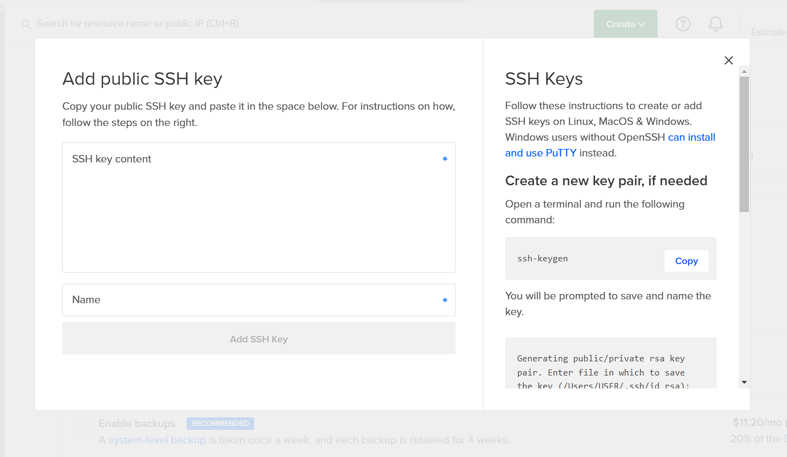

# Deploying MERN Stack App on DigitalOcean
In this tutorial, we'll deploy a MERN Stack application on a DigitalOcean server in the cloud with SSL/HTTPS encryption and a custom domain.

Furthermore, Nginx will be used as a reverse proxy and Let's Encrypt and Certbot will be used to configure SSL/HTTPS encryption for your application.

When the Node.js application is running on the server, we'll use PM2 to keep the application running forever without any downtime.

### Let's get started!

## Step 1 - Create & Configure A New DigitalOcean Server

Before we can do anything, we need to create and configure a VPS (Virtual Private Server) in the cloud to host our application.

### Create New Droplet On DigitalOcean

After logging in or successfully signing up for a new account, open the Create drop-down menu and click the Droplets link.

In the first section, select the Ubuntu operating system for your server.


Then, choose the $6 per month standard plan, which will give your application plenty of computing power to start with. You can easily upgrade in the future if needed.


Next, they allow you to choose the datacenter region for your server. This is the physical location for your server and, therefore, you should choose the one closest to the people visiting your website.


In the Authentication section, make sure the SSH keys option is selected for more security and passwordless login to your server.


### Setting up SSH in DigitalOcean Droplet

Click on the `New SSH Key` button and a pop up will open to add a public SSH key.



You need to generate an SSH key on your local machine to login to your server remotely. Open your terminal and type:

```bash
$ ssh-keygen
```

By default, it will create your public and private key files in the .ssh directory on your local machine and name them **id_rsa** and **id_rsa.pub**. You can change this if you want, just make sure when it asks, you put the entire path to the key as well as the filename. I am using **digital_ocean_key**.

Once you do that, you need to copy the public key. You can use the `cat` command and then copy the key

```bash
$ cat ~/.ssh/digital_ocean_key.pub
```

Copy the key. It will look something like this:

```bash
ssh-rsa AAAAB3NzaC1yc2EAAAADAQABAAABgQDEwMkP0KHX19q2dM/9pB9dpB2B/FwdeP4egXCgdEOraJuqGvaylKgbu7XDFinP6ByqJQg/w8vRV0CsFXrnr+Lh51fKv8ZPvV/yRIMjxKzNn/0+asatkjrkOwT3f3ipbzfS0bsqfWTHivZ7UNMrOHaaSezxvJpPGbW3aoTCFSA/sUUUSiWZ65v7I/tFkXE0XH+kSDFbLUDDNS1EzofWZFRcdSFbC3zrGsQHN3jcit6ba7bACQYixxFCgVB0mZO9SOgFHC64PEnZh5hJ8h8AqIjf5hDF9qFdz2jFEe/4aQmKQAD3xAPKTXDLLngV/2yFF0iWpnJ9MZ/mJoLVzhY2pfkKgnt/SUe/Hn1+jhX4wrz7wTDV4xAe35pmnajFjDppJApty+JOzKf3ifr4lNeZ5A99t9Pu0294BhYxm7/mKXiWPsevX9oSZxSJmQUtqWWz/KBVoVjlTRgAgLYbKCNBzmw7+qdRxoxxscQCQrCpJMlat56vxK8cjqiESvduUu78HHE= rtewa@DESKTOP-HQRNFTC
```

Now paste that into the textarea and name it (eg. digital_ocean_key)


Also, you can choose a hostname for your server. This will give your server a name to remember it by.


When you're done selecting options, hit the Create Droplet button to kick off the creation of your new server.


Your server is now up and running!


In the next step, we'll complete the initial configuration process for the server. This will include logging into the server, setting up SSH access to the server, and creating a basic firewall.

### Access The Server Using Root

The first step is to gain access to the server using your root login.

To log into your server, open a terminal on your local machine and use the following command to SSH in as the root user (replace `SERVER_IP_ADDRESS` with your server's public IP address and `PRIVATE_KEY` with the private key file name):

```bash
ssh -i ~/.ssh/PRIVATE_KEY_FILE_NAME root@SERVER_IP_ADDRESS
```

Accept the warning about host authenticity, if it appears.

The `root` user in a Linux environment has very broad privileges and, for that reason, you are discouraged from using it on a regular basis.

Therefore, in the next step, we are going to create an alternative account with limited scope that will be used for daily work.

### Create A New User

Right now you are logged in as `root` and it is a good idea to create a new account.

You can check your current user with the command:

```console
root@hostname:~# whoami
```

It will say `root` right now.

Let's add a new user. I am going to call my user `rohit`

```console
root@hostname:~# adduser rohit
```

Just hit enter through all the questions. You will be asked for a use password as well. You can just hit `ENTER` repeatedly to skip the rest of the questions.


### Give Your New User Root Privileges

You now have a new user account with regular account privileges. But you might occasionally need to do administrative tasks that require `root` privileges.

To do this, we need to add your new user to the `sudo` group on the machine.

As `root`, run the following command to add your user to the `sudo` group (substitute `rohit` with your username):

```console
root@hostname:~# usermod -aG sudo bob
```

Now your user can run commands with `root` privileges!

### Add SSH keys for new account

Assuming you generated an SSH key pair. Use the following command at the terminal of your local machine to print your public key (`digital_ocean_key.pub`):

```bash
$ cat ~/.ssh/digital_ocean_key.pub
```

Copy the key. It will look something like this:

```bash
ssh-rsa AAAAB3NzaC1yc2EAAAADAQABAAABgQDEwMkP0KHX19q2dM/9pB9dpB2B/FwdeP4egXCgdEOraJuqGvaylKgbu7XDFinP6ByqJQg/w8vRV0CsFXrnr+Lh51fKv8ZPvV/yRIMjxKzNn/0+asatkjrkOwT3f3ipbzfS0bsqfWTHivZ7UNMrOHaaSezxvJpPGbW3aoTCFSA/sUUUSiWZ65v7I/tFkXE0XH+kSDFbLUDDNS1EzofWZFRcdSFbC3zrGsQHN3jcit6ba7bACQYixxFCgVB0mZO9SOgFHC64PEnZh5hJ8h8AqIjf5hDF9qFdz2jFEe/4aQmKQAD3xAPKTXDLLngV/2yFF0iWpnJ9MZ/mJoLVzhY2pfkKgnt/SUe/Hn1+jhX4wrz7wTDV4xAe35pmnajFjDppJApty+JOzKf3ifr4lNeZ5A99t9Pu0294BhYxm7/mKXiWPsevX9oSZxSJmQUtqWWz/KBVoVjlTRgAgLYbKCNBzmw7+qdRxoxxscQCQrCpJMlat56vxK8cjqiESvduUu78HHE= rtewa@DESKTOP-HQRNFTC
```

Select the public key, and copy it to your clipboard.

To enable the use of the SSH key to authenticate as the new remote user, you must add the public key to a special file called `authorized_keys` in the user's home directory.

**On your DigitalOcean server** and as the `root` user, enter the following command to temporarily switch to the new user (substitute `rohit` with your username):

```console
root@hostname:~# su - rohit
```

Now you will be in your new user's home directory.

Create a new directory called `.ssh` and restrict its permissions with the following commands:

```console
rohit@hostname:~$ mkdir ~/.ssh && chmod 700 ~/.ssh
```

Now create a new file in `.ssh` called `authorized_keys` with a text editor. We'll use `nano` to edit the file:

```console
rohit@hostname:~$ nano ~/.ssh/authorized_keys
```

Now insert your public key (which should be in your clipboard) by pasting it into the editor.

Hit `CTRL-X` to exit the file, then `Y` to save the changes that you made, then `ENTER` to confirm the file name.

Now restrict the permissions of the `authorized_keys` file with this command:

```console
rohit@hostname:~$ chmod 600 ~/.ssh/authorized_keys
```

Type this command once to return to the `root` user:

```console
rohit@hostname:~$ exit
```

Now your public key is installed, and you can use SSH keys to log in as your user.

### Disable Password Authentication

This is an extra security step. We can disable passwords so that only your local machine with the correct SSH keys can login.

As the `root` user or new `sudo` user on your **DigitalOcean server**, open the SSH daemon configuration file using the following command:

```console
rohit@hostname:~$ sudo nano /etc/ssh/sshd_config
```

Find the line that says `PasswordAuthentication` and change its value to `no`. It should look like this after the change was made:

```bash
PasswordAuthentication no
```

Save and close the file using the method: `CTRL-X`, then `Y`, then `ENTER`.

To reload the SSH daemon and put the changes live, execute the following command:

```console
rohit@hostname:~$ sudo systemctl reload sshd
```

Password authentication is now disabled. Now your server can only be accessed with SSH key authentication.

### Test Log In Using SSH Key

Let's test logging in using the SSH key.

On your **local machine**, SSH into your server using the new account that we created. Use the following command to do so (substitute your username and IP address):

```bash
$ ssh USERNAME@SERVER_IP_ADDRESS
```

If you have too many keys on your local Machine, then you can try specifying which key you want to use:

```bash
$ ssh -i ~/.ssh/PRIVATE_KEY_FILE_NAME USERNAME@SERVER_IP_ADDRESS
```

Once authentication is provided to the server, you will be logged in as your new user.

### Basic Firewall Set Up

Another security improvement we can make to the server is to add a basic firewall so that people can not directly access any port except ports for ssh, http and https

On your **DigitalOcean server**, you can see which applications UFW currently allows by typing:

```console
rohit@hostname:~$ sudo ufw app list
```

We need to make sure the firewall allows SSH connections so that we can log back in next time. We also need to open the ports which are 22, 80 and 443. To allow these types of connections, type the following commands:

```console
rohit@hostname:~$ sudo ufw allow OpenSSH
rohit@hostname:~$ sudo ufw allow ssh # Port 22
rohit@hostname:~$ sudo ufw allow http # Port 80
rohit@hostname:~$ sudo ufw allow https # Port 443
```

And then enable the firewall:

```console
rohit@hostname:~$ sudo ufw enable
```

Press `y` and then `ENTER` to proceed. You can see that SSH connections are still allowed by typing:


```console
rohit@hostname:~$ sudo ufw status
```

That was the last step in the initial setup for the server.

## Step 2 - Configure Your Domain Name

In this section, we'll configure a domain name that you want to use for your Node.js application.

To set up a domain, you'll need to do two things:

1. Purchase a domain name from a domain name registrar.

2. Setup DNS (Domain Name System) records for your domain by using a DNS hosting service.

DigitalOcean is not a domain name registrar, which means you can't purchase a domain name from them. But, they do provide a DNS hosting service that makes it easy to configure a domain name with their servers.

### Configure DNS

Using DigitalOcean, let's configure DNS for your domain.

Back on the DigitalOcean website, open the Create drop-down menu and click the Domains/DNS link.

In the Add a Domain section, enter your domain (this is usually the base only: `example.com` and not `www.example.com`) and click the Add Domain button.


After you click the **Add Domain** button, you will be taken to the **Create new record** page.

You now need to add NS records for the domain on DigitalOcean servers. You'll only be adding `A` records, which maps an `IPv4 address` to a domain name. This will determine where to direct any requests for your domain name.

Therefore, we need to create two `A` records for your website.

For the first one, enter `@` in the `HOSTNAME` field and select the server you want to point the domain name to:


For the second one, enter `www` in the `HOSTNAME` field and select the same server:


Make sure the `A` records are pointed to the correct server droplet.

Awesome, we can move on to the next step.

### Configure Your Domain Registrar To Direct The Domain To DigitalOcean

To use the DigitalOcean DNS, you'll need to update the nameservers used by your domain registrar to point at DigitalOcean's nameservers instead.

As an example, we'll walk you through the steps for doing this for `Name.com`. But, these steps can be easily replicated for whatever other service you used (GoDaddy, HostGator, etc.).

First, sign in to your `Name.com` account and click `My Domains` link on the top navigation bar. You will be presented with a dashboard listing all of your domains.

Click the `Quick Links` dropdown then `Manage Domain` button of the domain you'd like to update.


In the `Nameservers` section of the resulting screen, click `Manage Nameservers` then enter the following nameservers:

* `ns1.digitalocean.com`
* `ns2.digitalocean.com`
* `ns3.digitalocean.com`


It may take some time for the name server changes to propagate after you've saved them.

During this time, the domain registrar communicates the changes you've made with your ISP (Internet Service Provider). In turn, your ISP caches the new nameservers to ensure quick site connections. This process usually takes about 30 minutes but could take up to a few hours depending on your registrar and your ISP's communication methods.

You should now have a domain pointing at your newly created DigitalOcean server.

## Step 3 - Install & Configure Nginx

Now we need to install NGINX to serve our app on port 80, which is the http port

### Install Nginx

Nginx is available in Ubuntu's default repositories, so installation is pretty straightforward.

On your **DigitalOcean server**, run the following commands to update your local `apt package` index so we have access to the most recent package lists:

```console
rohit@hostname:~$ sudo apt-get update && sudo apt-get install nginx
```

The `apt-get` command will install Nginx along with any other required dependencies.

When those commands finish, Nginx will be available for you to use on the server.

### Adjust The Firewall

Before we can test Nginx, we need to reconfigure our firewall software to allow access to the service. Nginx registers itself as a service with `ufw`, our firewall, upon installation. This makes it rather easy to allow Nginx access.

```console
rohit@hostname:~$ sudo ufw app list
```

You should get a listing of the application profiles:

```bash
Available applications:
  Nginx Full
  Nginx HTTP
  Nginx HTTPS
  OpenSSH
```

There are three profiles available for Nginx:

* **Nginx Full**: Opens both port `80` (normal, unencrypted web traffic) and port `443` (`TLS/SSL` encrypted traffic)
* **Nginx Http**: Opens only port `80` (normal, unencrypted web traffic)
* **Nginx Https**: Opens only port `443` (`TLS/SSL` encrypted traffic)

It is recommended that you enable the most restrictive profile that will still allow the traffic you've configured. Since we haven't configured SSL for our server yet, in this guide, we will only need to allow traffic on port `80`.

When we configure SSL/HTTPS encryption later on, we'll change these settings.

You can enable this by typing:

```console
rohit@hostname:~$ sudo ufw allow 'Nginx HTTP'
```

You can verify the change with this command:

```console
rohit@hostname:~$ sudo ufw status
```

You should see Nginx HTTP listed in the output.

### Test Your Web Server

The Nginx web server should already be up and running.

You can check with the systemd init system to make sure the service is running by typing:

```console
rohit@hostname:~$ systemctl status nginx
```

This should output the following:


You can access the default Nginx landing page to confirm that it is running properly. You can access this through your server's domain name or IP address.

When you have your server's IP address or domain, enter it into your browser's address bar:

```bash
http://SERVER_DOMAIN_OR_IP
```

You should see the default Nginx landing page, which should look something like this:


You now have a web server running!